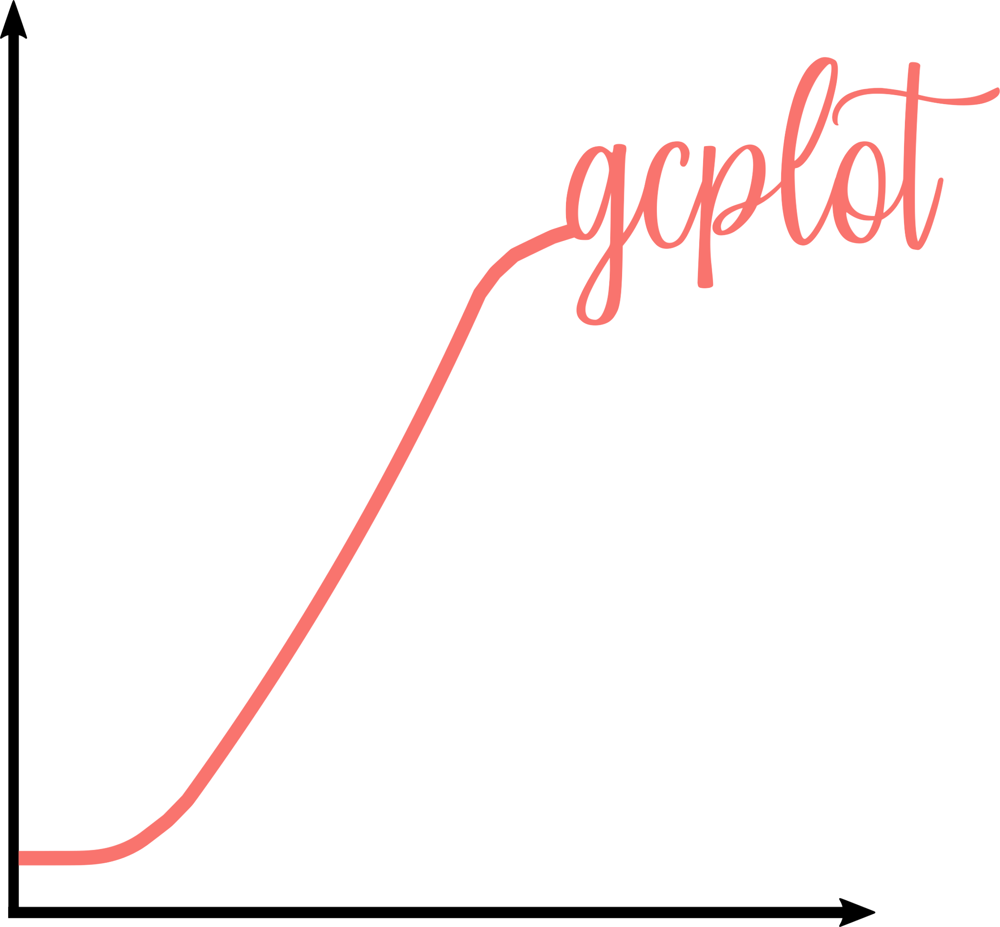

<p align="center"></p>

GCPlot is a plotting software for growth curves with biological replicates. It works with experiments as growing cells under different conditions or growing different cells under the same conditions. Each of this _differable_ varbiable, here, is called **treatment**. So, if one wants to compare growth of cells of the **specie A** under **37°C** and **40°C**, it's said that there are two different treatments: 37°C and 40°C. It is the same if one wants to compare growth of cells of **specie A** and **specie B** under a fixed condition of 37°C; there are two different treatments: specie A and specie B.

## Requirement
GCPlot only requires `R` and the package `ggplot2`

## Usage

gcplot can be run on Windows with the function `source()` on R console.

```r
> source("gcplot.R")
```

The growth curve file must be named as **gc_file.txt**, and the specification file as **spec_file.txt**.


 The example bellow shows a **gc_file.txt** with columns corresponding to 2 different treatments with 3 replicates each;
 
 |time|treatment1 - replicate1|treatment1 - replicate2|treatment2 - replicate1|treatment2 - replicate2|
 |---:|---:|---:|---:|---:|
 |0|0.5|0.5|0.5|0.5|
 |1|0.6|0.6|0.5|0.5|
 |...|...|...|...|...|
 |180|2.1|2.4|0.7|0.9|
 
 This treatments can be either different strains of cells or even different environmental contitions. In the second case, it would look like follows:
 
 |time|condition1 - replicate1|condition1 - replicate2|condition2 - replicate1|condition2 - replicate2|
 |---:|---:|---:|---:|---:|
 |0|0.5|0.5|0.5|0.5|
 |1|0.6|0.6|0.5|0.5|
 |...|...|...|...|...|
 |180|2.1|2.4|0.7|0.9|
 
 For example, see `gc_example_file.txt`
 
**spec_file.txt** is a file containing information about the experiment. The lines must contain, basically, information to   fill the output chart. The first two lines coresponds to X and Y label, respectively, and last one to the chart title.
 This file must be like follows:
 
 | |
 |-|
 |Growth estimation method (OD, NCels..), **default = `OD600`**|
 |Time units (hours, minutes ..), **default = `hours`**|
 |Chart title, **default = `NULL`**|
 
 For example, see `spec_example_file.spec`
 
 The chart image will be names as `plot.png`.


